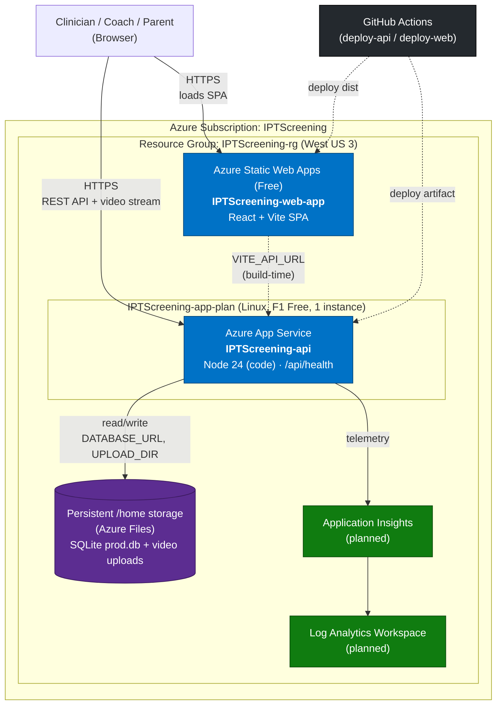

# Azure Infrastructure — IPT ACL Screening App

This document describes the Azure infrastructure expected to host the **IPT ACL Screening** application. It reflects the approved deployment plan in [`.azure/deployment-plan.md`](../.azure/deployment-plan.md).

## Overview

The application is a two-tier web app deployed from an npm workspaces monorepo:

- **API** (`packages/api`) — Node.js + Express + TypeScript + Prisma, hosted on **Azure App Service** (Linux container).
- **Web** (`packages/web`) — React + Vite single-page app, hosted on **Azure Static Web Apps**.
- **Database** — **SQLite** file stored on the App Service persistent `/home` volume (Azure Files backed).
- **File uploads** — Screening videos stored on the same persistent `/home` volume.
- **Observability** — Log Analytics workspace + Application Insights for the API.

| Setting | Value |
|---------|-------|
| Subscription | **IPTScreening** (`789044f6-8d42-4e17-9582-0f1c5ccf028d`) |
| Tenant | `06b0bff6-e8d5-4b97-8f55-54004ccf40a6` |
| Region | **West US 3** (`westus3`) |
| Resource Group | **`IPTScreening-rg`** (existing) |
| IaC / Tooling | Azure CLI (`az`) + GitHub Actions |

## Deployed Azure Resources

| Resource | Name | Type / SKU |
|----------|------|------------|
| App Service (API) | **`IPTScreening-api`** | Linux, NODE 24-lts, **F1 Free** |
| App Service Plan | **`IPTScreening-app-plan`** | Linux, **F1 Free** (shared by the API) |
| Static Web App (Web) | **`IPTScreening-web-app`** | **Free** tier |

- API URL: `https://iptscreening-api.azurewebsites.net`
- Web URL: `https://gentle-bay-059dbdd1e.7.azurestaticapps.net`

> The API is deployed as **code** (built artifact) on the built-in Node runtime, **not** as a container — the F1 Free tier does not support custom containers. The App Service plan starts on **F1 Free** and will be upgraded once there are real users.

## Architecture Diagram

## Components

### Azure App Service (API)

- **Plan:** Linux, **F1 Free** SKU (`IPTScreening-app-plan`), single instance. Upgrade the plan tier once real users arrive.
- **Why single instance:** SQLite allows only one concurrent writer. Scaling out would risk database file lock contention and corruption. Do **not** enable autoscale or increase instance count while on SQLite.
- **Runtime:** Deployed as **built code** on the built-in **NODE 24-lts** runtime (F1 Free does not support custom containers). The GitHub Actions workflow ships a self-contained artifact (`dist/`, `prisma/`, production `node_modules`).
- **Startup command:** `npm run start`, which runs `prisma migrate deploy` then `node dist/index.js`.
- **Health check:** `/api/health` (returns `200` with a timestamp).
- **Port:** Express binds `0.0.0.0` on the port App Service provides via `PORT`.

**App settings:**

| Name | Value | Purpose |
|------|-------|---------|
| `DATABASE_URL` | `file:/home/data/prod.db` | SQLite DB on persistent storage |
| `JWT_SECRET` | *(generated secret)* | JWT signing key |
| `CORS_ORIGIN` | Static Web App URL | Restrict cross-origin requests to the SPA |
| `UPLOAD_DIR` | `/home/data/uploads` | Video upload directory on persistent storage |
| `NODE_ENV` | `production` | Enables trust-proxy + production behavior |
| `WEBSITES_ENABLE_APP_SERVICE_STORAGE` | `true` | Ensures `/home` is durable (Azure Files) |
| `SCM_DO_BUILD_DURING_DEPLOYMENT` | `false` | Artifact is prebuilt in CI; no server-side build |

### Azure Static Web Apps (Web)

- **Build:** Vite production build (`npm run build` → `dist/`).
- **API base URL:** Injected at build time via `VITE_API_URL`, pointing to the App Service origin (e.g. `https://iptscreening-api.azurewebsites.net`).
- **Routing:** SPA fallback configured in `packages/web/staticwebapp.config.json` so client-side routes resolve to `index.html`.

### Persistent Storage

- App Service Linux exposes a durable `/home` directory backed by Azure Files when `WEBSITES_ENABLE_APP_SERVICE_STORAGE=true`.
- Holds:
  - `/home/data/prod.db` — the SQLite database.
  - `/home/data/uploads` — uploaded screening videos.
- This storage survives app restarts and redeploys.

### Observability

- **Application Insights** collects request/dependency/exception telemetry from the API.
- **Log Analytics Workspace** is the backing store for App Insights and platform logs.

## Request & Data Flow

1. The user's browser loads the React SPA from **Static Web Apps** over HTTPS.
2. The SPA calls the **App Service** API (base URL baked in via `VITE_API_URL`). Requests include a JWT `Authorization` header.
3. The API authenticates the JWT, then reads/writes the **SQLite** database and streams/stores **videos** on the persistent `/home` volume.
4. The API emits telemetry to **Application Insights**, backed by **Log Analytics**.

## Deployment

Deployment is automated with **GitHub Actions** (repo: `sumanchakrabarti/issy-pt-screening`, branch `main`):

| Workflow | Trigger | Target |
|----------|---------|--------|
| `.github/workflows/deploy-api.yml` | changes under `packages/api/**` | App Service `IPTScreening-api` |
| `.github/workflows/deploy-web.yml` | changes under `packages/web/**` | Static Web App `IPTScreening-web-app` |

**API workflow:** `npm ci` → `npm run api:build` (prisma generate + tsc) → assemble a self-contained `deploy/` folder (`dist`, `prisma`, prod `node_modules`, `prisma generate`) → deploy via `azure/webapps-deploy` using the `AZUREAPPSERVICE_PUBLISHPROFILE` secret.

**Web workflow:** `npm ci` → `npm run web:build` with `VITE_API_URL` set to the API origin → upload `packages/web/dist` via `Azure/static-web-apps-deploy` using the `AZURE_STATIC_WEB_APPS_API_TOKEN` secret.

### Required GitHub secrets

| Secret | Source |
|--------|--------|
| `AZUREAPPSERVICE_PUBLISHPROFILE` | `az webapp deployment list-publishing-profiles --name IPTScreening-api -g IPTScreening-rg --xml` |
| `AZURE_STATIC_WEB_APPS_API_TOKEN` | `az staticwebapp secrets list --name IPTScreening-web-app -g IPTScreening-rg --query properties.apiKey -o tsv` |

## Cost Estimate (rough, monthly)

| Resource | SKU | Est. |
|----------|-----|------|
| App Service Plan | **F1 Free** Linux | **$0** |
| Static Web App | Free | **$0** |
| Log Analytics + App Insights | Pay-as-you-go (low volume) | ~$0–5 |
| **Total** | | **~$0–5/mo** |

> F1 Free has quotas (60 CPU minutes/day, 1 GB storage, no custom domains/SSL beyond the default host, no always-on). Move the plan to **B1** or higher before onboarding real users.

## Known Limitations & Planned Follow-ups

> ⚠️ This topology is a pragmatic **first deployment**. It is **not** suitable for real PHI at scale as-is.

- **SQLite + single instance** — no horizontal scaling and a single point of failure. Migrate to **Azure SQL Database (TDE)** or **Azure Database for PostgreSQL Flexible Server** before storing real patient data.
- **Video storage on App Service** — migrate uploads to **Azure Blob Storage** (server-side encryption) for durability and scale.
- **Secrets** — move `JWT_SECRET` into **Azure Key Vault** (referenced via App Service Key Vault references).
- **Compliance** — a **Business Associate Agreement (BAA)** with Microsoft is required before storing PHI in Azure. Enable Azure SQL auditing and diagnostic logging.

## Related Documents

- Deployment plan: [`.azure/deployment-plan.md`](../.azure/deployment-plan.md)
- Project overview & HIPAA notes: [`README.md`](../README.md)
